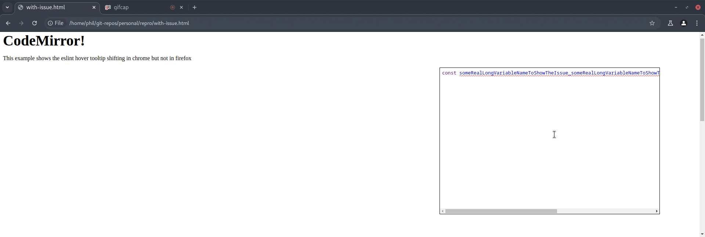

# reproduction of issue

This branch shows an issue where the tooltip will resize in chrome

## To run

```sh
$ git clone git@github.com:olsonpm/repro.git
$ cd repro
$ git checkout codemirror-tooltip-resizing
$ npm ci
$ # open ./with-issue.html in chrome
```

## Screenshot


