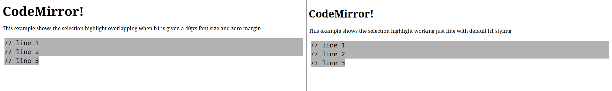

# reproduction of issue

This branch shows an issue where selection highlighting can overlap in firefox

## To run

```sh
$ git clone git@github.com:olsonpm/repro.git
$ cd repro
$ git checkout codemirror-selection-overlap
$ npm ci
$ # open ./with-issue.html in firefox
```

## Screenshot


